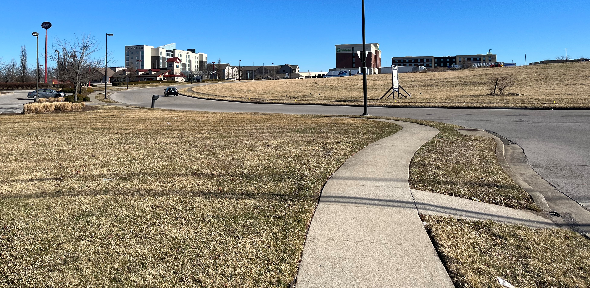
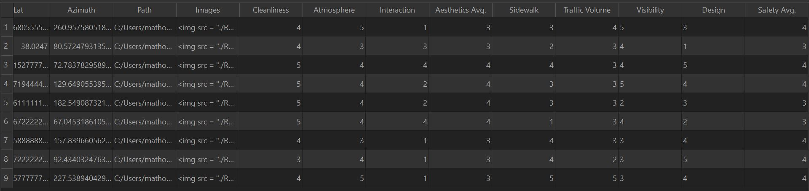
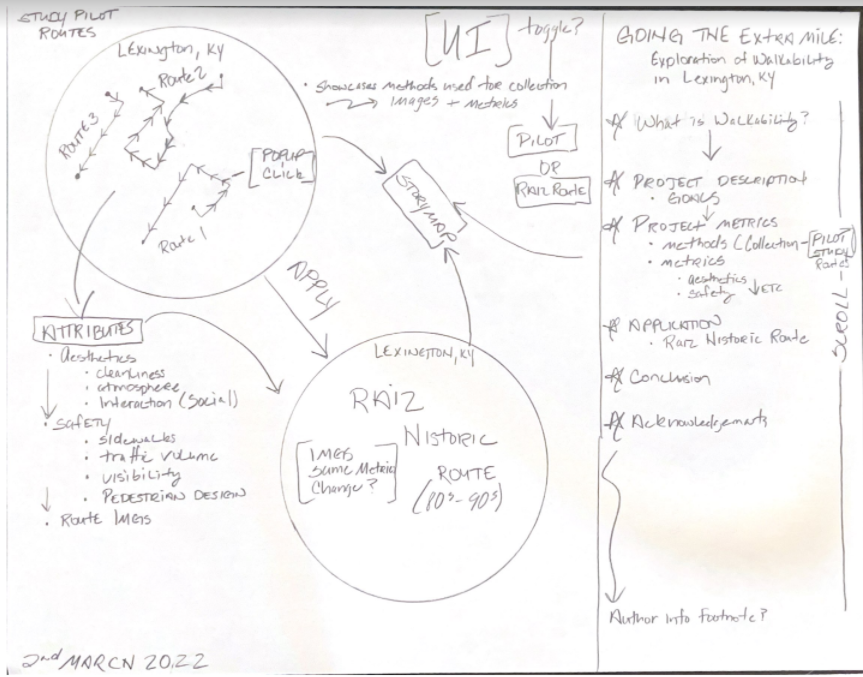
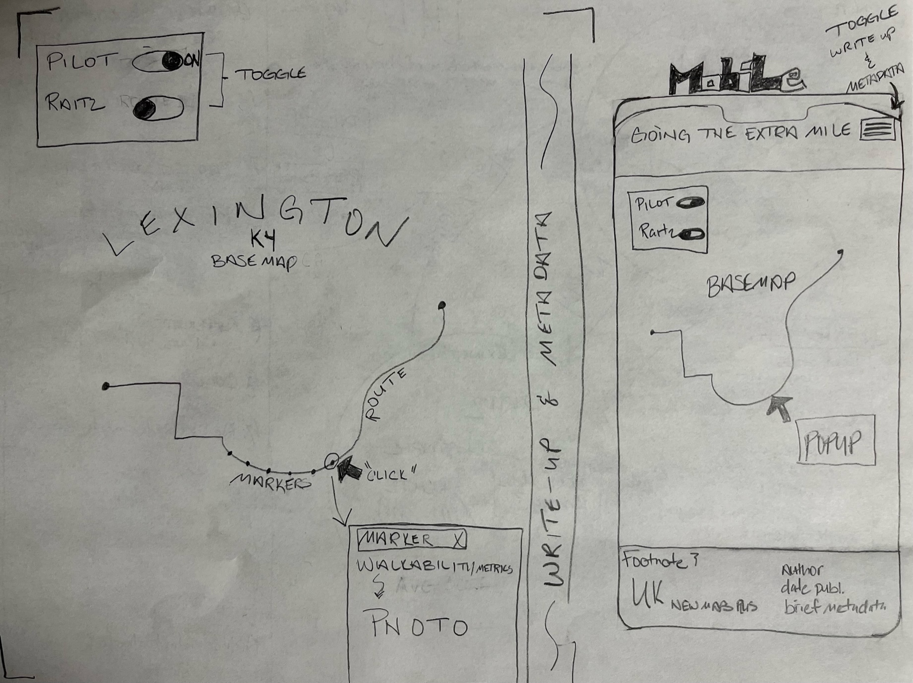

<!-- *************************************DRAFT******************************************* -->

# Exploration of Walkability in Lexington, KY

topic: I want to design a map and narrative that explores the walkability index...
question: to assess societal infrastructure impacts...
motivation: and how we can re-define walkability to promote better health and sustainability.

# Table of Contents
+ [Introduction](#I-Introduction)
+ [Walkability Assessment](#II-Walkability-Assessment)
+ [Methodology](#III-Methodology)
+ [Data](#A-Data)
+ [Medium for Delivery](#B-Medium-for-Delivery)
+ [Application Layout](#C-Application-Layout)
+ [Thematic Representation](#D-Thematic-Representation)
+ [User Interaction](#E-User-Interaction)
+ [Aesthetics and Design](#F-Aesthetics-and-Design)
+ [Conclusion](#G-Conclusion)
+ [Acknowledgements](#H-Acknowledgements)

# I. Introduction

Despite the associated benefits of exercise, many of us struggle to remain active and keep up with the hustle and bustle of life. Fortunately, we still obtain some physical exercise as part of our daily routine through transportation and leisurely means. Inherent though design, urban planning strives to faciliate more walking into our lifestyle. Walkability is an important urban design concept that is mutually beneficial to the well-being of communities and their efficiency. Walking enables urban planning to not only perpetuate sustainable transportation and its reduced emissions, but promote healthy and livable communities. Initially adopted in response to increased population densities and urban sprawl, walkability developed into a multi-faceted solution in health, sustainability, and livability. 

Established in 2017 by the EPA, the Walkability Index (WI) is a publically accessible metric enabling people to assess and compare neighborhood walkability. Comprised of three core elements (design, distance to transit, and area diversity), the WI's roots align with urban planning and travel. The WI typically exists through two modes of association: walking context and urbal-rural status. Although a useful appraisal, it is not without flaw. At the whim of it's user, the index is easily predisposed towards environmental factors that could inflate the score. The WI is a skeletal framework where it's metrics vary according to the given environment and the user's intent. Although widely applicable, bias is inenvitable. Where the WI often appears as a malleable appraisal assigned to a community and it's neighborhood amenities, I aim to redefine and lease a different perspective on walkability. Utilizing ground truth data supported by new metrics, walkability defined by route appears more effective and can facilitate improvement through urban planning and pedestrian collaboration. 

The following map conducts it's examination on routes and metrics in Lexington,KY. Through cartographic and user design, this map will appeal to those in city planning/urban safety and explore metrics pedestrians value most during a walk. The user will be encouraged to see walkability through the eyes of pedestrians and consider improvements that would make walking more enjoyable. Those in city planning/urban safety will gain pedestrian experience and concerns, which will help to facilitate walking that enhances the pedestrian experience.

# II. Walkability Assessment

Walkability is a concept that is not unlike a blank canvas, requiring creativity, purpose, and inspiration. It's ability to be molded into an index with background and intent is profound, enabling application into a variety of topics. However, having an open layout such as this leaves room for biases and nuances that muddle it's purpose. The core of walkability resides with the metrics used, resembling the purpose and intent of the index while retaining any nuances. What follows are two example that emphasize the importance of metrics and their control of walkability indexes.

The EPA has a series of interactive maps concerning location efficiency titled *Smart Location Mapping*. One particular map focusing on downtown Chicago emits ambiguity through a lack of metric breakdown.

After referencing the legend, we see that downtown Chicago is much more walkable than surrounding suburbs and rural areas. The potential issue here is it's broad application, leaving the index open to bias through subjective means. Chicago might be more walkable in terms of distance, but what about comfort level and safety? If the index metrics focus on crime rate and cleanliness, I doubt anyone would suggest Chicago is more walkable in that regard. The use of metrics without pedestrian consideration inevitably introduces subjectivity as the user attemps to fill in the ambivalence. 

A useful interactive website [Walk Score](https://www.walkscore.com/) brings walkability and location efficiency to your finger tips! Search any address or area and find a walk score associated with each search. This interactive web-map is a great concept, but exploring *Walk Score* really opened my eyes on walkability and inpired me to emphasize the importance of metrics. After any search, clicking on the walk score will open up a dialogue box that breaks down the metrics that generate the score. Below is an example of the metrics used in *Walk Score*.

These metrics are essentially amenities and local hotspots that can potentially facilitate more walking through close proximity. Makes sense, right? Everyone has walked to a local restaurant/bar, stores, and parks to get out and enjoy life. However, these metrics define walkability based on the motivated potential of walkability.

In these two instances we clarify that without supportive metrics, walkability indexes are succeptible to bias and subjectivity. I propose that a change in perspective can effectively reduce the aforementioned nuances. 

# III. Methodology 

This project's methodology is comprised of numerous subsections that cover data, application, interaction, and overall front-end design. 

## A. Data

**Data Source**:
The data source is ground-truth from field collection in Lexington, KY. Pictures taken with IPhone 13.

**Data Acquisition & Wrangling**:
Data is represented as markers that outline each route. Collection involved physically walking each route, taking photos with GPS coordinates, and rating the walkability of a photo's location through a series of compiled metrics. This project's data acquisition and wrangling process varies from the workflow taught in NewMaps plus, but only as a result of acquiring data in the field.  

Metrics used to rate Walkability:
+ Aesthetics
    + Cleanliness
    + Atmosphere
    + Interaction
+ Safety
    + Sidewalks
    + Traffic Volume
    + Visibility
    + Pedestrian Design

Metric Analysis Example:

 

**Data Processing**

After collection, data was processed into routes and markers...

**Routes**
+ Routes were mapped within Google Maps
+ URL copied and pasted into [Maps To GPX](https://mapstogpx.com/)
    + GPX (the GPS Exchange Format) is a text-based format derived from XML and often used to encode GPS data
+ Exported routes as GPX (GPS Exchange)
+ GPX files loaded into [geojson.io](http://geojson.io/) and converted to usable mapping format, GeoJSON

**Markers**
+ Photos were taken along each route and labeled according to their route and sequence (e.g. R1P5)
+ Each photo taken was geotagged using an IPhone 13 and uploaded
+ Photos organized into appropriate directories 
+ Photos imported using ImportPhotos QGIS 3.16.1 Hannover plugin
+ GPS coordinates of each photo exported as geoJSON using ImportPhotos plugin
+ Attribute tables cleaned up and metric collections added as new field data

**Anticipated Format**
+ Marker data will be hosted in geoJSON format for web-mapping

**Additional Content**
+ Geotagged Photos in popup

## B. Medium for Delivery

The map is a web browser-based application accessible across mobile and desktop devices that utilizes a specific technology stack that incorporates application, thematic representation, and user interaction. The technology stack includes HTML, CSS, JavaScript (Leaflet & JQuery) to create a responsive framework.

## C. Application Layout

**Wireframe**

**Layout Across Devices**

## D. Thematic Representation

The data will be visually represented in a series of markers for each route, showcasing metric analysis and geotagged photos.

## E. User Interaction

The user interaction will be simple and straightforward. Informative buttons will enable the user to dive into the project's metadata and analysis. Since data will be visually represented as markers, basic interactions such as panning and zooming are likely. The data uses an event listener that initiates a popup when clicked, containing the walkability metrics and photos. To aid the user in maintaining their bearing, markers turn to a blue ring when moused-on and return to a different color fill when moused-out, signifying that marker has already been viewed.

## F. Aesthetics and Design Considerations

The basemap and data background should be informative, but not so detailed that the overall map becomes cluttered and the data overwhelmed. A simple monochrome basemap with road networks would suffice, but having satellite imagery to supplement marker photos would be ideal. Having satellite imagery on as the sole basemap would definitely crowd the data. Maybe a UI addition that enables toggling between basemaps could mitigate such issue.

## G. Conclusion

Walkability is simple in nature, but is often muddled and molded to support each topic and authors' intent. It is a broad framework and although widely applicable, walkability as we know it is biased and often used to market neighborhoods and communities. This study paints walkability in a different light, whereas defined by route rather than community. Inspired by ground-truth data, new metrics are purely route and pedestrian driven, creating transparency between pedestrian values and urban planning. Utilizing ground-truth and pedestrian experience, urban planning is able to dissect entire communities at a larger scale and enhance walkability route by route. 

## H. Acknowledgements

I would like to give special thanks to Laura Wright and Joel Sizemore, engineers at Strand Associates, for helping with data collection and analysis. Their input was invaluable, as it mitigated bias and provided pedestrian design experience to the analysis. I would also like to thank Rich Donohue, for his continuous support and encouragement throughout this project and the NewMapsPlus program.
