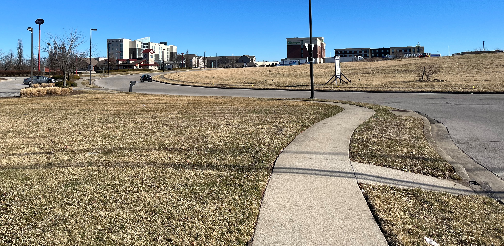
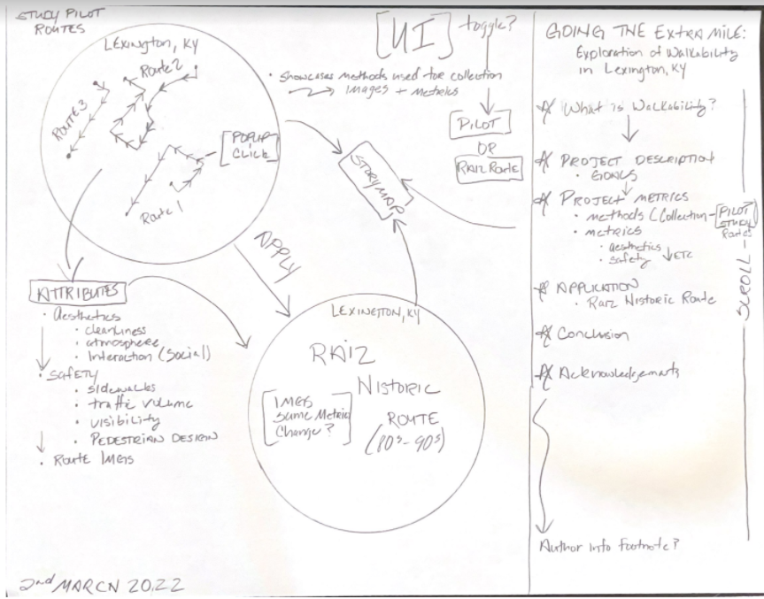
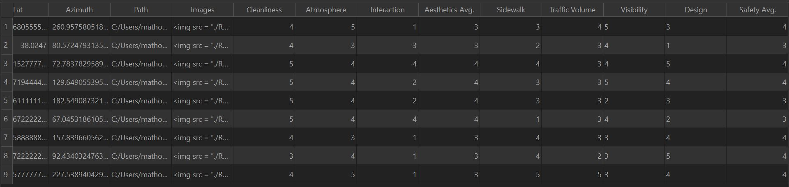
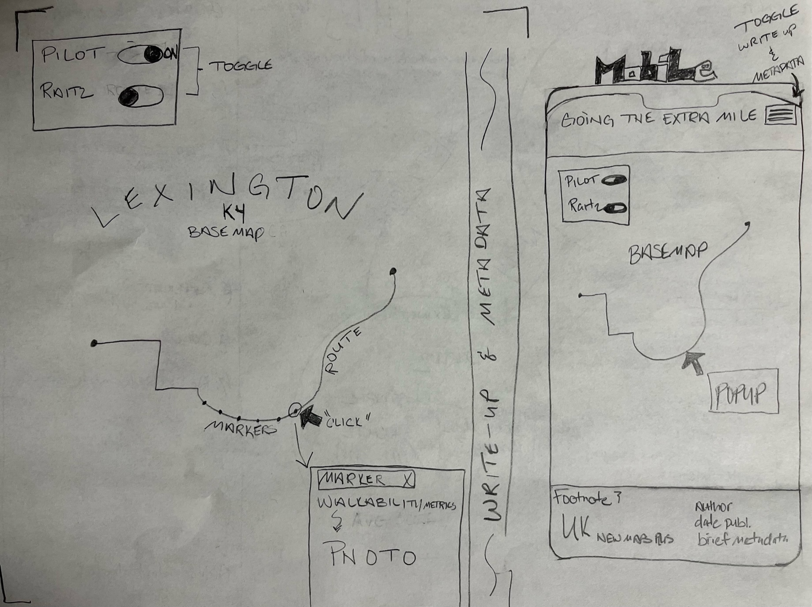

<!-- *************************************DRAFT******************************************* -->

# Going the Extra Mile
## Exploration of Walkability in Lexinton, KY

topic: I want to design a map and narrative that explores the walkability index...
question: to assess societal infrastructure impacts...
motivation: and how we can re-define walkability to promote better health and sustainability.

# Table of Contents
+ [Introduction](#I-Introduction)
+ [Methodology](#II-Methodology)
+ [Data](#A-Data)
+ [Medium for Delivery](#B-Medium-for-Delivery)
+ [Application Layout](#C-Application-Layout)
+ [Thematic Representation](#D-Thematic-Representation)
+ [User Interaction](#E-User-Interaction)
+ [Aesthetics and Design](#F-Aesthetics-and-Design)
+ [Conclusion](#G-Conclusion)

# I. Introduction

Despite the associated benefits of exercise, many of us struggle to remain active trying to keep up with the hustle and bustle of life. Fortunately, physical activity is a part of our daily routine through transportation and leisurely means. Inherent though design, urban planning strives to faciliate more walking into our lifestyle. Walkability is an important urban design concept that is mutually beneficial to the well-being of communities and their efficiency. Walking enables urban planning to not only perpetuate sustainable transportation and its reduced emissions, but promote healthy and livable communities. Initially adopted in response to increased population densities and urban sprawl, walkability developed into a multi-faceted solution in health, sustainability, and livability. 

Established in 2017 by the EPA, the Walkability Index (WI) is a publically accessible metric enabling people to assess and compare neighborhood walkability. Comprised of three core elements (design, distance to transit, and area diversity), the WI's roots align with urban planning and travel. The WI is typically exists through two modes of association: walking context and urbal-rural status. Although a useful appraisal, it is not without flaw. At the whim of it's user, the index is easily predisposed towards environmental correlates that could potentially inflate the score. The WI is essentially a skeletal framework where it's metrics vary according to the given environment and the user's intent. Although widely applicable, bias is inenvitable. Where most studies and surveys hold the WI as a malleable appraisal assigned to a community or area, I aim to redefine and simplify walkability. Utilizing ground truth data comprised of metrics desireable to pedestrians, I connotate that walkability is better defined by route whereas metrics rarely change and bias is greatly reduced. 

The following map conducts it's examination on routes and their metrics in Lexington,KY. Through cartographic and user design, this map will appeal to those in city planning/urban safety and explore metrics pedestrians' value most during a walk. The user will be informed on the idea of walkability and what it means to them and their community. Those in city planning/urban safety will see walkability in a new perspective and hopefully be inspired to improve their designs.

**Wireframe**

# II. Methodology 

This project's methodology is comprised of numerous subsections that cover data, application, interaction, and overall front-end design. 

## A. Data

**Data Source**:
The data source is ground-truth from field collection in Lexington, KY. 

**Data Acquisition & Wrangling**:
Data is represented as routes and markers. Collection involved physically walking each route, taking photos with GPS coordinates, and rating the walkability of a photo's location through a series of compiled metrics. Initial pilot data collected is to verify methodology and approach. 

Metrics used to rate Walkability:
+ Aesthetics
    + Cleanliness
    + Atmosphere
    + Interaction
+ Safety
    + Sidewalks
    + Traffic Volume
    + Visibility
    + Pedestrian Design

After collection, data was processed into routes and markers...

**Routes**
+ Initially digitized in Google Maps
+ Converted Google Maps URL to [GPX file](https://mapstogpx.com/)
+ Converted GPX file into GeoJSON using [geojson.io](http://geojson.io/)
    + Added names of route points to data attribute property "name"
    + data attribute properties description and symbology removed from encoding

**Markers**
+ Photos were taken along each route and labeled according to their route and sequence (e.g. R1P5)
+ Each photo taken was geotagged using an IPhone 13 and uploaded
+ Photos organized into appropriate directories 
+ Photos imported using ImportPhotos QGIS 3.16.1 Hannover plugin
+ GPS coordinates of each photo exported as geoJSON using ImportPhotos plugin
+ Attribute tables cleaned up and metric collections added as new field data

**Anticipated Format**
+ Route and Marker data will be hosted in geoJSON forat for web-mapping

**Additional Content**
+ Karl Raitz's historic route

## B. Medium for Delivery

The map is a web browser-based application accessible across mobile and desktop devices which will utilize a specific technology stack that incorporates application, thematic representation, and user interaction. This is tentative, but as a baseline, this project's technology stack will most likely require HTML, SVG, CSS, JavaScript, and Bootstrap to create a responsive framework.

## C. Application Layout

**Layout Across Devices**

## D. Thematic Representation

The data used will be visually represented in a series of points and lines where the points will be proportionally symbolized according to walkability metrics. The size of the proportional symbol will likely encode average ratings of either aesthetics or safety.

## E. User Interaction

The user interaction will be simple and straightforward. Of to one side will be an informative panel that will enable the user to scroll through the project's write-up and metadata. Considering the data will be visually represented as points and lines, basic interactions such as panning and zooming are likely. The proportional markers containing the walkability metrics and photos would work well paired with a click event listener triggering a popup. Each marker popup would show the walkability metrics and associated photo.

## F. Aesthetics and Design Considerations

## G. Conclusion

